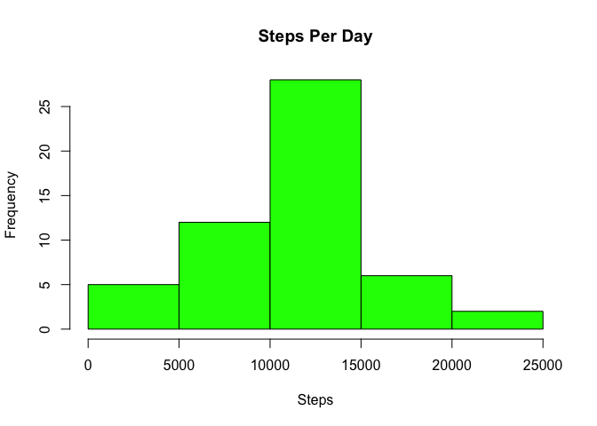
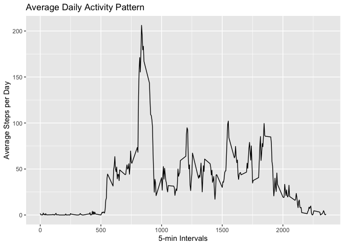
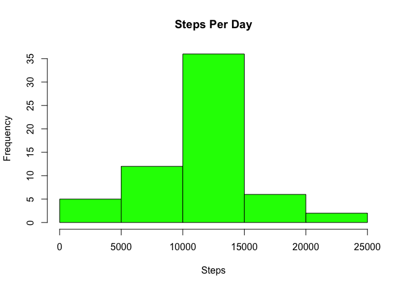
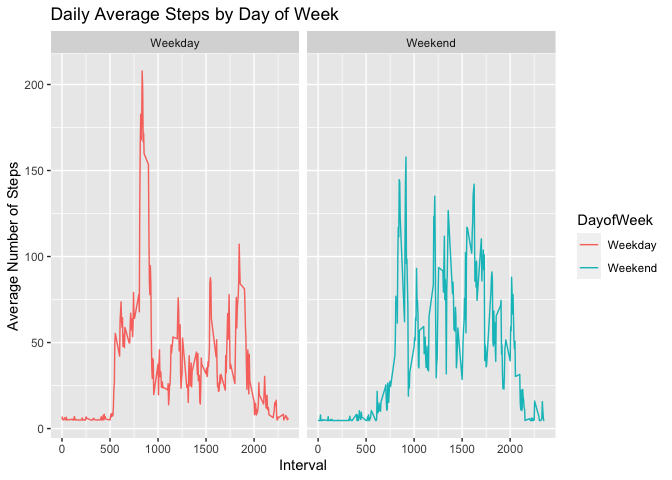

## Loading and preprocessing the data

```r
library(ggplot2)
activity <- read.csv("activity.csv")
```

## Create Histogram

```r
steps_per_day<- aggregate(steps ~ date, activity, FUN=sum)
hist(steps_per_day$steps, col = "green", main = "Steps Per Day", xlab = "Steps")
```

<!-- -->

## What is mean and median total number of steps taken per day?

```r
mean(steps_per_day$steps)
```

```
## [1] 10766.19
```

```r
median(steps_per_day$steps)
```

```
## [1] 10765
```

## What is the average daily activity pattern?

```r
daily_activity <- aggregate(steps ~ interval, activity, FUN = mean, na.rm = TRUE)
names(daily_activity) <- c("interval", "avgsteps")
ggplot(daily_activity, aes(interval, avgsteps)) + geom_line() + ggtitle("Average Daily Activity Pattern") + xlab("5-min Intervals") + ylab("Average Steps per Day")
```

<!-- -->

## Which 5-min interval contains the max number of steps?

```r
daily_activity[which.max(daily_activity$avgsteps), "interval"]
```

```
## [1] 835
```


## Total number of missing values

```r
sum(is.na(activity$steps))
```

```
## [1] 2304
```

##Fill in missing values with average steps per day

```r
ReplacedNA <- activity
ReplacedNA$steps[is.na(ReplacedNA$steps)] <- mean(daily_activity$avgsteps)
```

##Histogram and mean/median of new dataset without missing values

```r
steps_per_day2 <- aggregate(steps ~ date, ReplacedNA, FUN = sum, na.rm = TRUE)
hist(steps_per_day2$steps, col = "green", main = "Steps Per Day", xlab = "Steps")
```

<!-- -->

```r
mean(steps_per_day2$steps)
```

```
## [1] 10766.19
```

```r
median(steps_per_day2$steps)
```

```
## [1] 10766.19
```

## Are there differences in activity patterns between weekdays and weekends?

```r
ReplacedNA$date <- as.Date(strptime(ReplacedNA$date, format="%Y-%m-%d"))
days <- weekdays(ReplacedNA$date)
DayofWeek <-sapply(ReplacedNA$date, function(x) {
    if(weekdays(x) == "Saturday" | weekdays(x) == "Sunday")
    {day <- "Weekend"}
    else {day <- "Weekday"}
    day })

ReplacedNA <- cbind(ReplacedNA, days, DayofWeek)

daytype_activity <- aggregate(steps ~ interval + DayofWeek, ReplacedNA, FUN = mean, na.rm = TRUE)
names(daytype_activity) <- c("interval", "DayofWeek", "avgsteps")
ggplot(daytype_activity, aes(interval, avgsteps, color = DayofWeek)) + geom_line() + facet_wrap(~DayofWeek) + ggtitle("Daily Average Steps by Day of Week") + xlab("Interval") + ylab("Average Number of Steps")
```

<!-- -->
